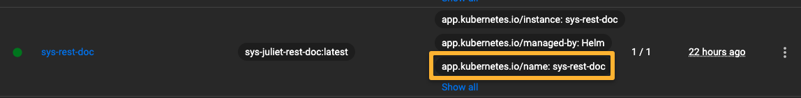
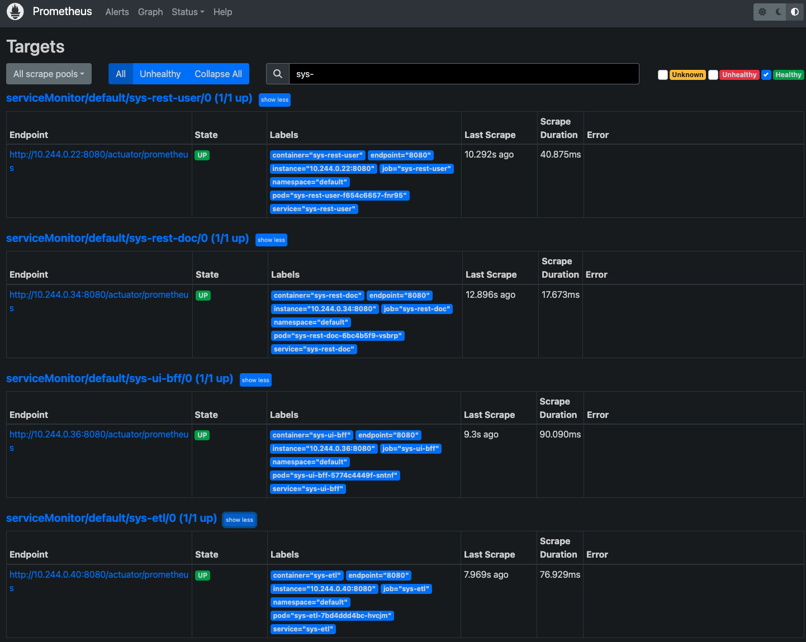
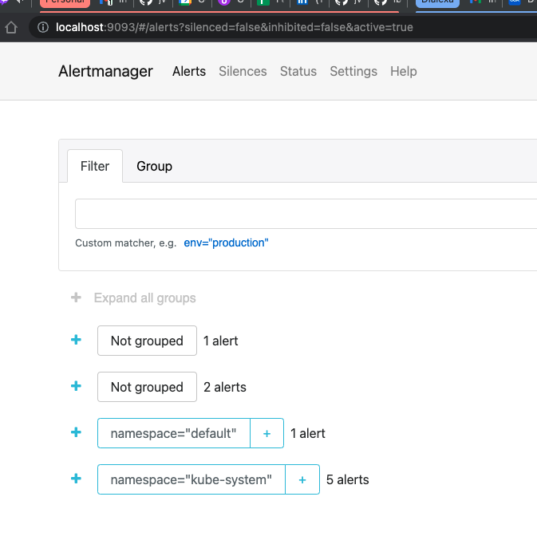

# System Juliet Monitoring

This project represents the Prometheus-based monitoring stack as run on Kubernetes via Helm, as a part of the overall https://github.com/jvalentino/sys-juliet project. For system details, please see that location.

Prerequisites

- Git
- Helm
- Minikube

All of these you can get in one command using this installation automation (if you are on a Mac): https://github.com/jvalentino/setup-automation

Monitoring in this case consist of several things:

## Stack

**Prometheus**

> Prometheus is an open-source systems monitoring and alerting toolkit originally built at SoundCloud. Since its inception in 2012, many companies and organizations have adopted Prometheus, and the project has a very active developer and user community. It is now a standalone open source project and maintained independently of any company. To emphasize this, and to clarify the project's governance structure, Prometheus joined the Cloud Native Computing Foundation in 2016 as the second hosted project, after Kubernetes.

https://prometheus.io/docs/introduction/overview/

**Alertmanager**

> The Alertmanager handles alerts sent by client applications such as the Prometheus server. It takes care of deduplicating, grouping, and routing them to the correct receiver integration such as email, PagerDuty, or OpsGenie. It also takes care of silencing and inhibition of alerts.

https://prometheus.io/docs/alerting/alertmanager/

Consider that by default it works by scraping special text name/value pair formatted endpoints, which is why we had to install this for the Java applications:

**Micrometer Prometheus Registry**

> Spring Boot uses Micrometer, an application metrics facade to integrate actuator metrics with external monitoring systems.
>
> It supports several monitoring systems like Netflix Atlas, AWS Cloudwatch, Datadog, InfluxData, SignalFx, Graphite, Wavefront, Prometheus etc.
>
> To integrate actuator with Prometheus, you need to add the micrometer-registry-prometheus dependency -
>
> Once you add the above dependency, Spring Boot will automatically configure a PrometheusMeterRegistry and a CollectorRegistry to collect and export metrics data in a format that can be scraped by a Prometheus server.
>
> All the application metrics data are made available at an actuator endpoint called /prometheus. The Prometheus server can scrape this endpoint to get metrics data periodically.

https://www.callicoder.com/spring-boot-actuator-metrics-monitoring-dashboard-prometheus-grafana/

## Deployment

Prerequisites (to see the applications being monitored)

- sys-ui-bff - https://github.com/jvalentino/sys-juliet-ui-bff
- sys-etl - https://github.com/jvalentino/sys-juliet-etl
- sys-rest-user - https://github.com/jvalentino/sys-juliet-rest-user
- Sys-ui - https://github.com/jvalentino/sys-juliet-ui
- Sys-rest-doc - https://github.com/jvalentino/sys-juliet-rest-doc

To re-install it, forward ports, and then verify it worked, use:

```bash
./deploy.sh
```

The basis of this script is a helm configuration:

```bash
#!/bin/sh
helm repo add prometheus-community https://prometheus-community.github.io/helm-charts
helm delete prometheus --wait || true
helm install -f config/helm/prometheus/values.yaml prometheus --wait prometheus-community/kube-prometheus-stack
sh -x ./verify.sh
```

...where the verification handles port forwarding and can also be run on its own:

```bash
#!/bin/sh
mkdir build || true

kubectl port-forward --namespace default svc/prometheus-operated 9090:9090 > build/prometheus-server.log 2>&1 &
curl http://localhost:9090

while [ $? -ne 0 ]; do
    kubectl port-forward --namespace default svc/prometheus-operated 9090:9090 > build/prometheus-server.log 2>&1 &
    curl http://localhost:9090
    sleep 5
done

kubectl port-forward --namespace default svc/alertmanager-operated 9093:9093 > build/alertmanager.log 2>&1 &
curl http://localhost:9093

while [ $? -ne 0 ]; do
    kubectl port-forward --namespace default svc/alertmanager-operated 9093:9093 > build/alertmanager.log 2>&1 &
    curl http://localhost:9093
    sleep 5
done
```

Getting the port forwarding to work isn't an exact science, thus the for-loop.

## Configuration

The stack is complicated enough though where the configuration at `config/helm/prometheus/values.yaml` is several thousand lines long. The key though, is adding the configurations to monitor all the other applications:

```yaml
  additionalServiceMonitors:
  - name: sys-rest-doc
    namespace: default
    selector:
      matchLabels:
        app.kubernetes.io/name: sys-rest-doc
    namespaceSelector:
      matchNames:
        - default
    endpoints:
      - targetPort: 8080
        interval: 10s
        path: "/actuator/prometheus"
  - name: sys-rest-user
    namespace: default
    selector:
      matchLabels:
        app.kubernetes.io/name: sys-rest-user
    namespaceSelector:
      matchNames:
        - default
    endpoints:
      - targetPort: 8080
        interval: 10s
        path: "/actuator/prometheus"
  - name: sys-ui-bff
    namespace: default
    selector:
      matchLabels:
        app.kubernetes.io/name: sys-ui-bff
    namespaceSelector:
      matchNames:
        - default
    endpoints:
      - targetPort: 8080
        interval: 10s
        path: "/actuator/prometheus"
  - name: sys-etl
    namespace: default
    selector:
      matchLabels:
        app.kubernetes.io/name: sys-etl
    namespaceSelector:
      matchNames:
        - default
    endpoints:
      - targetPort: 8080
        interval: 10s
        path: "/actuator/prometheus"
```

This took so much time to figure out, it isn't funny. The key is that you have to use the matcher to locate application instances using labels that exist in Kubernetes, which are done by the names you have in the Helm configurations as `app.kubernetes.io/name`.



The endpoints are the ones running from a cluster perspective both on 8080 on two different pods, which from a localhost perspective can be reached on http://localhost:8080/actuator/prometheus and http://localhost:8081/actuator/prometheus, and contain a wall of text that looks like this:

```properties
# HELP hikaricp_connections_max Max connections
# TYPE hikaricp_connections_max gauge
hikaricp_connections_max{pool="HikariPool-1",} 10.0
hikaricp_connections_max{pool="HikariPool-2",} 10.0
# HELP jvm_threads_peak_threads The peak live thread count since the Java virtual machine started or peak was reset
# TYPE jvm_threads_peak_threads gauge
jvm_threads_peak_threads 35.0
# HELP jvm_threads_states_threads The current number of threads
# TYPE jvm_threads_states_threads gauge
jvm_threads_states_threads{state="runnable",} 6.0
jvm_threads_states_threads{state="blocked",} 0.0
jvm_threads_states_threads{state="waiting",} 19.0
jvm_threads_states_threads{state="timed-waiting",} 6.0
jvm_threads_states_threads{state="new",} 0.0
jvm_threads_states_threads{state="terminated",} 0.0
# HELP jdbc_connections_min Minimum number of idle connections in the pool.
# TYPE jdbc_connections_min gauge
jdbc_connections_min{name="secondary",} 10.0
jdbc_connections_min{name="primary",} 10.0
```

## Runtime (Prometheus)

You can tell that it is both running and working, by hitting http://localhost:9090/targets, where you will see a ton of endpoints being monitoring:



## Runtime (Alert Manager)

You can tell that the Alertmanager is running by hitting http://localhost:9093/:

